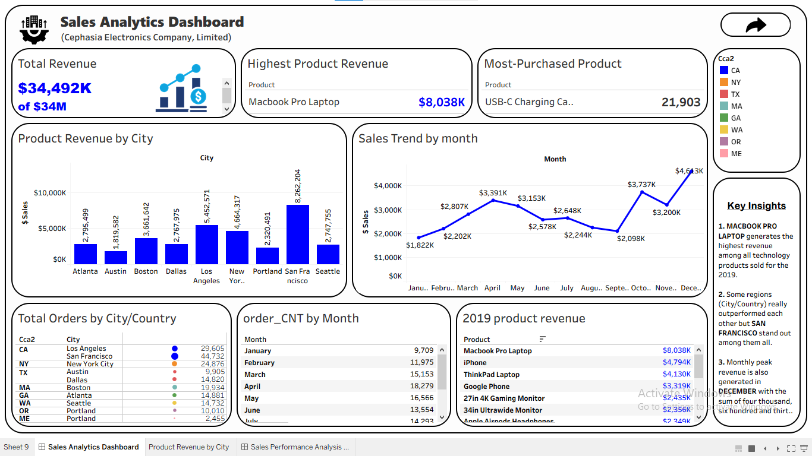
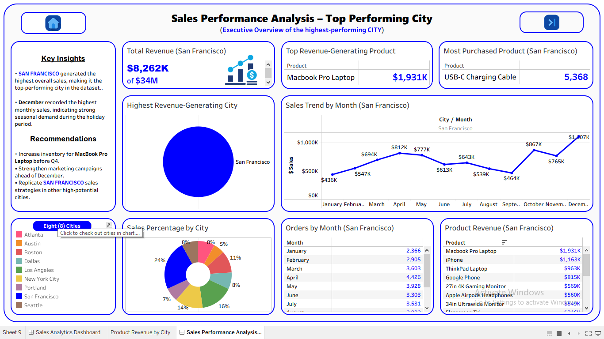

# Sales Data Analysis

### Project Overview
This project analyzes retail sales data to uncover insights for solving business problems that supports better decision-making. The analysis focuses on sales trends, regional performance, product performance, and profitability.

---

### Business Problem
Businesses need to understand their daily, monthly and yearly sales performance in order to identify growth opportunities and improve profitability.

---

### Objectives

- Analyze overall sales performance.
- Identify top-performing products and categories.
- Examine regional sales trends.
- Discover key business insights.
---

### Tools Used

- Python

  Pandas - Data Cleaning & EDA
  
  Matplotlib - Exploratory Data Analysis

- Tableau - Dashboard Development
---

### Workflow

1. Data Cleaning
2. Exploratory Data Analysis (EDA)
3. Data Visualization
4. Dashboard Creation
5. Insights and Reccomendations
---

### Key Insights

- Technology products generated the highest revenue - `MacBook Pro Laptop`.
- Some regions consistently outperformed others.
- Sales showed strong seasonal patterns.
---

### Dashboard Preview

- 
---
  
- 
---

### Repository Structure
data/ - Dataset files

notebooks/ - Jupyter notebooks

images/ - Dashboard screenshots

README.md - Project documentation

---
## Recommendations
- Focus marketing efforts on high-performing regions.
- Increase inventory for top-selling products.
- Investigate underperforming categories to improve profitability.
---

# 👨‍💻 Author

**Opeyemi (Ismail) Peter**

Data Analyst | Business Intelligence

GitHub:
https://github.com/Cephasia

LinkedIn:
https://ng.linkedin.com/in/opeyemi-peter-394b333a1

---
